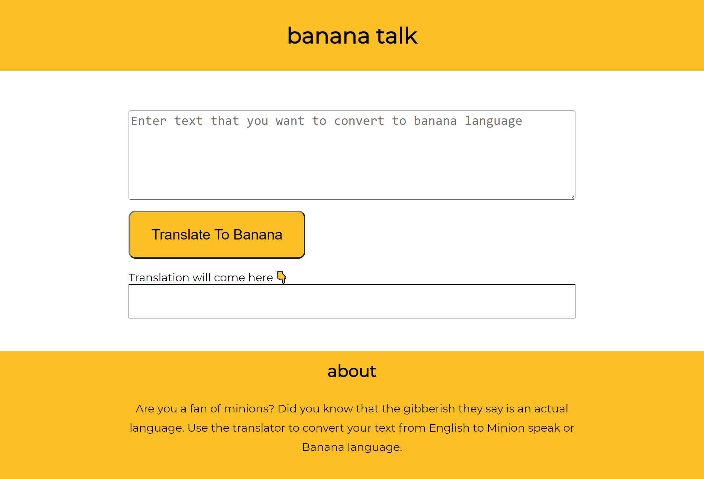

# Fun translator app

This is a fun translator app which takes some text as input and translates it to minionese using fun translations api and displays the translated text.

## Overview

### Screenshot



### Links

- Live Site URL: [https://minionese-translator-app.netlify.app/](https://minionese-translator-app.netlify.app/)

## My process

### Built with

- HTML
- CSS
- JavaScript

### What I learned

Learned how to select html elements in the javascript file using `document.querySelector()` and then to add event listeners on that element.

```js
const button = document.querySelector(".btn");

button.addEventListener("click", clickHandler);
```

## Author

- Twitter - [@DarshanDamre](https://twitter.com/DarshanDamre)
- LinkedIn - [Darshan Damre](https://www.linkedin.com/in/darshandamre/)
- Website - [Darshan Damre](https://darshandamre.netlify.app/)
